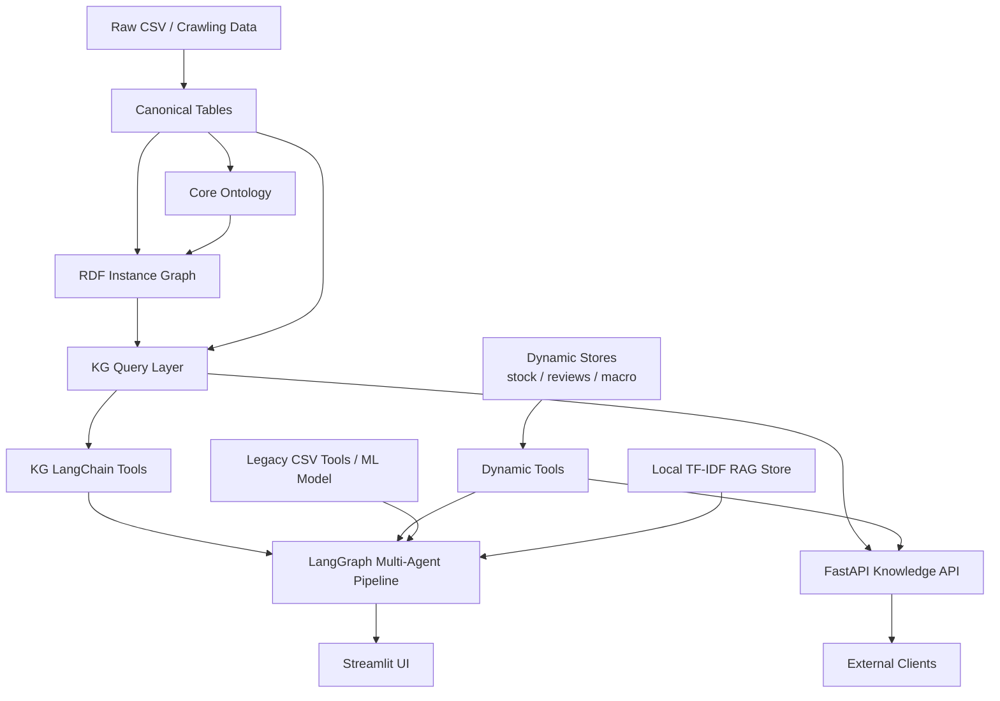

# Biz-Insight v2

Biz-Insight는 국내 기업의 재무, 신용등급, 투자지표, 주가, 직원 리뷰, 거시경제 데이터를 하나의 분석 맥락으로 연결해 기업 리포트를 생성하는 지식 그래프 기반 AI 분석 프로젝트입니다.

v2 리팩토링의 핵심은 원본 CSV를 바로 에이전트에 넘기던 구조를 `canonical data -> ontology -> knowledge graph -> tools/API -> LangGraph agents` 흐름으로 분리한 것입니다. 데이터의 출처와 형태가 달라도 기업, 지표, 기간, 평가기준, 위험 신호라는 공통 모델로 조회할 수 있도록 만들고, 이 컨텍스트를 FastAPI와 Streamlit, LangGraph 멀티 에이전트에서 재사용합니다.

포트폴리오 데모의 기획 메시지는 명확합니다. 대형주는 이미 해석된 정보가 많지만, 코스닥 성장기업은 공시, 뉴스, 실적, 산업 데이터, 직원 리뷰가 흩어져 있어 해석 비용이 높습니다. Biz-Insight는 이 분산된 정보를 연결해 기업의 성장 논리와 리스크를 빠르게 보여주는 것을 목표로 합니다.

## What Changed In v2

- 원본 CSV를 표준 중간 테이블인 canonical 테이블로 정규화
- Protege에서 열 수 있는 경량 OWL/Turtle 온톨로지 추가
- RDFLib 기반 기업 중심 지식 그래프 인스턴스 생성
- stock code 기반 기업 프로필, 관측값, 신용등급, 평가기준 근거, 위험 신호 조회 계층 추가
- KG 조회 도구와 dynamic signal 도구를 LangGraph 에이전트에 연결
- FastAPI 기반 지식 API 추가
- Streamlit UI에서 자연어 요청을 받아 LangGraph 리포트 생성
- legacy CSV 검색을 위한 로컬 TF-IDF RAG 벡터스토어 유지

## Architecture



## Data Model

v2는 데이터 품질 문제를 에이전트 프롬프트에서 해결하지 않고, 먼저 데이터 모델에서 해결합니다.

| Layer | Role | Main Files |
|---|---|---|
| Raw data | 수집 및 전처리된 기존 CSV | `data/*.csv` |
| Canonical tables | 기업, 별칭, 지표, 관측값, 신용등급, 리뷰 요약을 표준 스키마로 정규화 | `src/canonical/`, `data/canonical/` |
| Ontology | 클래스, 속성, 평가기준, 위험 신호 개념 정의 | `ontology/bizinsight-core.ttl` |
| RDF graph | canonical 테이블을 Turtle 인스턴스로 변환 | `src/kg/rdf_builder.py`, `data/kg/bizinsight-instances.ttl` |
| Query layer | API와 에이전트가 재사용하는 Python 조회 함수 | `src/kg/queries.py` |
| Dynamic stores | 주가, 리뷰, 거시경제처럼 갱신 주기가 있는 데이터 snapshot | `src/dynamic/`, `data/dynamic/` |

canonical 테이블은 원본 데이터의 컬럼명과 형태 차이를 흡수하는 중간 계층입니다. 예를 들어 wide format의 재무 지표는 `observations.csv`에서 `subject_type`, `subject_id`, `metric_code`, `period_type`, `period_value`, `numeric_value` 형식의 long format 관측값으로 변환됩니다.

## Knowledge Graph

온톨로지는 `Company`, `Sector`, `Metric`, `Observation`, `CreditRating`, `EmployeeReview`, `EvaluationCriterion`, `RiskSignal`을 중심으로 구성됩니다.

기업 식별자는 기업명이 아니라 `stock_code`입니다. 기업명은 데이터 소스마다 표기가 흔들리기 때문에 `CompanyAlias`로 분리합니다.

주요 조회 함수는 다음과 같습니다.

- `search_company_by_name`: 기업명 alias 검색으로 stock code 후보를 찾습니다.
- `get_company_profile`: stock code 기준 기업 기본 정보와 alias를 조회합니다.
- `get_company_observations`: 기업별 지표 관측값을 조회합니다.
- `get_credit_ratings`: 실제/예측 신용등급 이력을 조회합니다.
- `get_criteria_evidence`: 수치 지표를 평가기준별 근거로 묶습니다.
- `get_risk_context`: 규칙 기반 위험 신호를 추출합니다.
- `get_knowledge_context`: 리포트 생성에 필요한 KG 컨텍스트를 한 번에 조립합니다.

## Multi-Agent Pipeline

Streamlit UI는 `src.graph.generate_ai_report()`를 호출하고, 내부에서는 LangGraph가 다음 노드를 실행합니다.

| Agent | Responsibility |
|---|---|
| Supervisor | 자연어 요청에서 분석 도메인과 허용 도구를 결정 |
| Researcher | alias 검색으로 stock code를 확정하고 KG/dynamic/legacy 도구로 데이터 수집 |
| Analyst | 수집 결과를 바탕으로 재무, 신용, 투자, 리뷰, 리스크 분석 수행 |
| Reviewer | 분석의 누락, 논리성, 위험 언급 여부를 검토하고 필요하면 재분석 요청 |
| Synthesis | 사용자에게 보여줄 최종 마크다운 리포트 작성 |

Supervisor는 `overview`, `financial`, `credit`, `investment`, `review`, `risk` 도메인을 추론하고, Researcher가 사용할 수 있는 도구 allow-list를 좁힙니다. 이렇게 하면 전체 도구를 무조건 열어두는 방식보다 실행 비용과 불필요한 tool calling을 줄일 수 있습니다.

## API

FastAPI 앱은 `src/api/main.py`에 있습니다.

주요 엔드포인트:

- `GET /health`
- `GET /companies/search?name=삼성전자`
- `GET /companies/{stock_code}`
- `GET /companies/{stock_code}/knowledge-context?year=2022`
- `POST /reports/company-analysis`

로컬 실행:

```bash
UV_PROJECT_ENVIRONMENT=bizinsight uv run --no-sync uvicorn src.api.main:app --reload
```

Swagger UI:

```text
http://127.0.0.1:8000/docs
```

## Streamlit App

Streamlit 진입점은 루트의 `app.py`입니다. 기업명을 검색하고 분석 유형 또는 자연어 요청을 입력하면 LangGraph 멀티 에이전트가 실행됩니다.

```bash
UV_PROJECT_ENVIRONMENT=bizinsight uv run --no-sync streamlit run app.py
```

포트폴리오 데모 배포는 전체 `data/` 대신 `data/demo` snapshot을 사용하는 것을 권장합니다.

```bash
BIZINSIGHT_DATA_DIR=data/demo \
BIZINSIGHT_APP_PASSWORD=your-demo-password \
UV_PROJECT_ENVIRONMENT=bizinsight uv run --no-sync streamlit run app.py
```

데모 배포 절차와 데이터 caveat은 `docs/DEMO_DEPLOYMENT.md`를 참고하세요. 데모 데이터는 2026-06-13 KST 기준의 작은 샘플이며, 삼성전자·현대자동차·카카오를 KOSPI 기준점으로, 케이아이엔엑스·씨앤씨인터내셔널·제이브이엠·덕산네오룩스·인텔리안테크를 KOSDAQ 성장기업 분석 대상으로 둡니다.

리포트 생성 후에는 화면의 `리포트 작성 과정 보기`에서 실행된 에이전트, 호출 도구, 데이터 출처 marker를 확인할 수 있습니다.

`.env`에는 LLM 호출을 위한 `GOOGLE_API_KEY`가 필요합니다.

```text
GOOGLE_API_KEY=...
```

LangSmith tracing을 활성화하려면 `.env`에 아래 값을 추가합니다. `LANGSMITH_PROJECT`는 LangSmith에서 실행을 묶어 볼 프로젝트 이름입니다.

```text
LANGSMITH_TRACING=true
LANGSMITH_API_KEY=...
LANGSMITH_PROJECT=biz-insight-local
# LANGSMITH_ENDPOINT=https://api.smith.langchain.com
```

환경변수가 설정되면 Streamlit의 `AI 리포트 생성 시작` 버튼에서 실행되는 LangGraph run이 LangSmith에 기록됩니다. 각 실행에는 `biz-insight-report` run name, `query_type:*` tag, 기업명과 사용자 요청 metadata가 포함됩니다.

## Build Data Artifacts

canonical 테이블 생성:

```bash
UV_PROJECT_ENVIRONMENT=bizinsight uv run --no-sync python -m src.canonical.build_all
```

RDF 인스턴스 그래프 생성 및 검증:

```bash
UV_PROJECT_ENVIRONMENT=bizinsight uv run --no-sync python -m src.kg.export_instances --validate
```

로컬 RAG 벡터스토어 생성:

```bash
UV_PROJECT_ENVIRONMENT=bizinsight uv run --no-sync python -m src.rag.build_vectorstore build \
  --data-dir data \
  --out-dir data/vectorstore \
  --max-rows-per-doc 80 \
  --max-features 100000
```

RAG 검색 예시:

```bash
UV_PROJECT_ENVIRONMENT=bizinsight uv run --no-sync python -m src.rag.build_vectorstore query \
  "신용등급 재무 안정성 부채 상환능력" \
  --entity 삼성전자 \
  --top-k 3
```

## Project Structure

```text
app.py
  Streamlit UI entrypoint

ontology/
  bizinsight-core.ttl
  Protege-compatible lightweight ontology

data/
  raw CSV datasets
  canonical/
    normalized intermediate tables
  dynamic/
    stock, review, macro snapshots
  kg/
    generated RDF/Turtle instance graph

src/
  api/
    FastAPI routers and response models
  agents/
    LangGraph agent nodes
  canonical/
    raw CSV to canonical table builders
  dynamic/
    dynamic signal stores
  kg/
    RDF builder and query layer
  rag/
    local TF-IDF vector store
  tools/
    LangChain tools for KG, dynamic stores, legacy CSV, ML
  graph.py
    LangGraph assembly and report generation entrypoint
  state.py
    shared LangGraph state
  config.py
    LLM and data path configuration

tests/
  canonical, KG query, API tests
```

## Development

Install dependencies with `uv` using the project environment used by this repository.

```bash
UV_PROJECT_ENVIRONMENT=bizinsight uv sync
```

Run tests:

```bash
UV_PROJECT_ENVIRONMENT=bizinsight uv run --no-sync python -m unittest discover -s tests
```

When changing the data model, update the flow in this order:

1. canonical builder
2. ontology class/property if a new concept is needed
3. RDF builder
4. KG query function
5. LangChain tool or API endpoint
6. Streamlit or agent prompt surface

## Blog Drafts

The v2 refactoring write-up lives in `docs/blog/`.

- `01-data-to-ontology.md`
- `02-ontology-to-knowledge-graph.md`
- `03-langgraph-multi-agent-design.md`
- `04-knowledge-graph-rag.md`
- `05-api-streamlit-serving.md`
