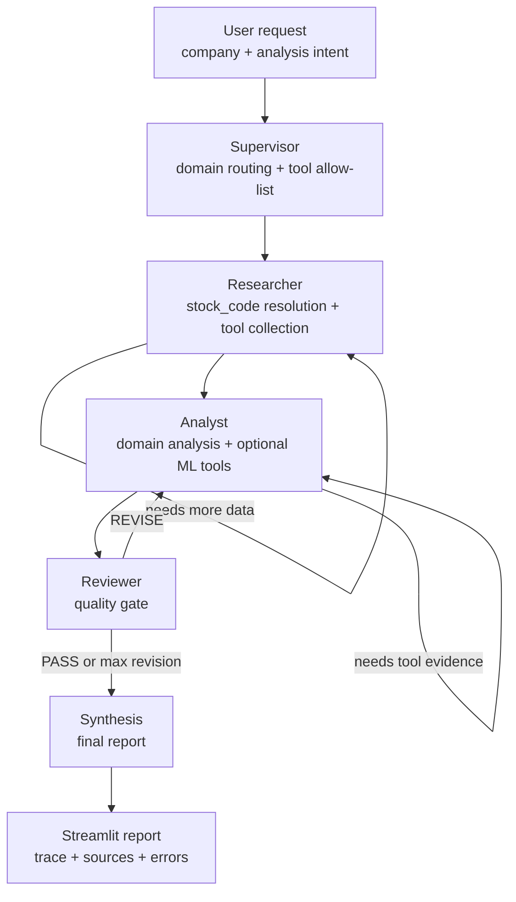
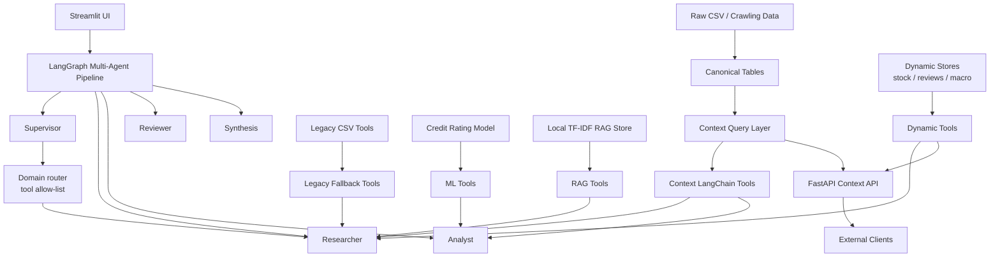
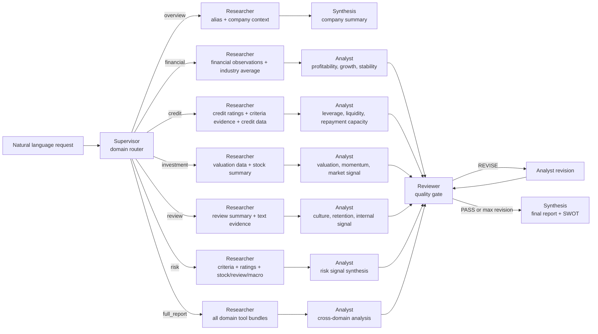

# Biz-Insight v2

Biz-Insight는 국내 기업의 재무, 신용등급, 투자지표, 주가, 직원 리뷰, 거시경제 데이터를 멀티에이전트가 수집, 분석, 검토, 종합해 기업 리포트를 생성하는 AI 분석 프로젝트입니다.

대형주는 이미 해석된 정보가 많지만, 코스닥 성장기업은 공시, 뉴스, 실적, 산업 데이터, 직원 리뷰가 흩어져 있어 해석 비용이 높습니다. Biz-Insight는 이 분산된 정보를 연결해 기업의 성장 논리와 리스크를 빠르게 보여주는 것을 목표로 합니다.


## Core: LangGraph Multi-Agent

이 프로젝트의 핵심은 데이터 테이블 자체가 아니라, 자연어 요청을 분석 목적별로 분해하고 필요한 도구만 열어 실행하는 LangGraph 기반 멀티에이전트 파이프라인입니다.

| Agent | Role | Key Behavior |
|---|---|---|
| Supervisor | 요청 해석과 실행 계획 수립 | `overview`, `financial`, `credit`, `investment`, `review`, `risk` 도메인을 추론하고 Researcher 도구 allow-list를 생성 |
| Researcher | 데이터 수집 | 기업명 alias 검색으로 `stock_code`를 확정한 뒤 canonical context, dynamic signal, legacy CSV/RAG 도구를 ReAct 방식으로 호출 |
| Analyst | 분석 초안 작성 | 수집 결과를 바탕으로 재무, 신용, 투자, 리뷰, 리스크를 해석하고 필요 시 ML 신용등급 예측/feature importance 도구 사용 |
| Reviewer | 품질 검토와 self-correction | 근거 누락, 데이터 기준일 혼동, stock code 미확정, 리스크 언급 누락을 검사하고 필요하면 Analyst로 재분석 요청 |
| Synthesis | 최종 리포트 작성 | 각 에이전트 산출물을 종합해 기준연도, 데이터 출처, 리스크, SWOT, 투자 의견을 포함한 마크다운 리포트 생성 |

기본 실행 흐름:



## Architecture



## Use Case Flows

Supervisor는 `query_type`과 자연어 키워드를 함께 보고 필요한 도메인만 선택합니다. 선택된 도메인에 따라 Researcher가 호출할 수 있는 도구가 달라지고, `overview`를 제외한 대부분의 요청은 Analyst와 Reviewer 단계를 거칩니다.



| Use Case | Primary Agents | Main Tool Bundle | Output Focus |
|---|---|---|---|
| `overview` | Supervisor, Researcher, Synthesis | alias search, company context, company info | 기업 식별, 산업, 기본 프로필 요약 |
| `financial` | Researcher, Analyst, Reviewer, Synthesis | observations, criteria evidence, financial CSV, industry average | 수익성, 성장성, 안정성, 산업 대비 |
| `credit` | Researcher, Analyst, Reviewer, Synthesis | credit rating history, credit data, criteria evidence, ML tools | 신용등급 이력, 상환능력, 재무부담 |
| `investment` | Researcher, Analyst, Reviewer, Synthesis | valuation data, stock summary, stock series | 밸류에이션, 주가 모멘텀, 투자 매력도 |
| `review` | Researcher, Analyst, Reviewer, Synthesis | review summary, review evidence, employee review CSV | 조직문화, 직원 평판, 내부 리스크 |
| `risk` | Researcher, Analyst, Reviewer, Synthesis | criteria evidence, risk signals, stock/review/macro context | 재무, 신용, 시장, 조직 리스크 종합 |
| `full_report` | All agents | all selected domain bundles | 종합 리포트, SWOT, 투자 의견 |

## Agent State And Trace

에이전트들은 공유 state를 통해 `requested_domains`, `allowed_research_tools`, `analyses`, `feedback`, `errors`, `researcher_messages`, `analyst_messages`를 누적합니다. Streamlit UI는 최종 리포트뿐 아니라 실행된 에이전트, 호출 도구, 데이터 출처 marker, 오류를 `리포트 작성 과정 보기`에서 함께 보여줍니다.

이 구조 덕분에 사용자는 단순 결과만 보는 것이 아니라, 어떤 도구가 어떤 근거를 가져왔고 Reviewer가 어떤 품질 기준으로 통과시켰는지 확인할 수 있습니다.

## Data Foundation

canonical data는 멀티에이전트가 안정적으로 도구를 호출하기 위한 기반 계층입니다. 원본 CSV의 컬럼명과 포맷 차이를 `stock_code`, `metric_code`, `period_value`, `numeric_value`, `source_file` 같은 공통 스키마로 맞춰 Researcher와 Analyst가 같은 방식으로 조회할 수 있게 합니다.

| Layer | Role | Main Files |
|---|---|---|
| Raw data | 수집 및 전처리된 기존 CSV | `data/*.csv` |
| Canonical tables | 기업, 별칭, 지표, 관측값, 신용등급, 리뷰 요약을 표준 스키마로 정규화 | `src/canonical/`, `data/canonical/` |
| Context query layer | API와 에이전트가 재사용하는 Python 조회 함수 | `src/context/queries.py` |
| Dynamic stores | 주가, 리뷰, 거시경제처럼 갱신 주기가 있는 데이터 snapshot | `src/dynamic/`, `data/dynamic/` |

대표 조회 함수는 `search_company_by_name`, `get_company_observations`, `get_credit_ratings`, `get_criteria_evidence`, `get_risk_context`, `get_knowledge_context`입니다.

## Product Surface

Biz-Insight는 Streamlit 기반 분석 화면과 FastAPI 기반 context API를 함께 제공합니다. Streamlit에서는 기업명과 자연어 요청을 입력해 멀티에이전트 리포트를 생성하고, 실행 후에는 에이전트 경로, 도구 호출, 데이터 출처 marker를 확인할 수 있습니다.

로컬 실행, 환경변수, 데이터 빌드 명령어는 내부 운영 문서인 `docs/USAGE.md`에 분리했습니다.

## Project Structure

```text
app.py
  Streamlit UI entrypoint

data/
  raw CSV datasets
  canonical/
    normalized intermediate tables
  dynamic/
    stock, review, macro snapshots

src/
  api/
    FastAPI routers and response models
  agents/
    LangGraph agent nodes
  canonical/
    raw CSV to canonical table builders
  context/
    canonical table query layer
  dynamic/
    dynamic signal stores
  rag/
    local TF-IDF vector store
  tools/
    LangChain tools for context, dynamic stores, legacy CSV, ML
  graph.py
    LangGraph assembly and report generation entrypoint
  state.py
    shared LangGraph state
  config.py
    LLM and data path configuration

tests/
  canonical, context query, API tests
```
