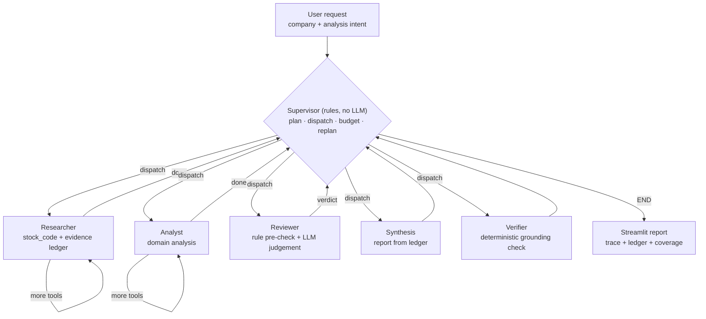
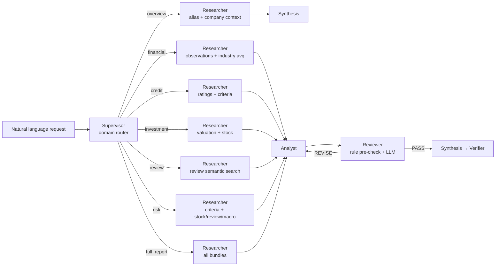

# Biz-Insight

자연어로 입력된 분석 니즈를 LangGraph 멀티에이전트가 해석해, 국내 기업의 재무·신용·투자·주가·**직원 후기**·거시경제 데이터에서 근거를 모으고 검증한 뒤 맞춤 리포트를 생성하는 프로젝트입니다.

이 README는 **무엇을 만들었는지보다 왜 그렇게 만들었는지**를 중심으로, 기획 의도 → 니즈 분석 → 구성 → 측정 → 개선의 순서로 씁니다. 실행 방법은 [`docs/USAGE.md`](docs/USAGE.md), 평가 하네스는 [`evals/README.md`](evals/README.md), 데모 배포는 [`docs/DEMO_DEPLOYMENT.md`](docs/DEMO_DEPLOYMENT.md)에 분리했습니다.

---

## 1. 기획 배경 및 의도

이 프로젝트는 두 단계를 거쳤고, 두 단계의 의도가 지금 구조를 결정했습니다.

### 근본 프로젝트 — 정규화된 도메인을 비정규화 데이터로 개선하기 (자연어 처리)

기업 신용·재무 분석은 **정규화된 프로세스와 정규화된 데이터** 위에서 돌아가는 도메인입니다. 재무제표는 계정과목이 정해져 있고, 신용등급은 평가기관의 기준표가 있고, 투자지표는 계산식이 고정돼 있습니다. 그만큼 잘 정리돼 있지만, 그 안에 담기지 않는 정보가 있습니다.

근본 프로젝트의 의도는 **이 정규화된 도메인·태스크를 비정규화 데이터로 개선하는 것**이었습니다. 특히 **자연어 기반의 직원 후기 데이터**입니다. 부채비율이 설명하지 못하는 조직의 이탈 신호, 재무제표에 찍히기 전의 내부 문제 같은 것들이 후기에는 먼저 나타납니다. 즉 출발점은 **자연어 처리**였습니다.

### 리팩토링 프로젝트 — 비정형 니즈를 받아 맞춤 리포트를 내놓기 (멀티에이전트)

리팩토링은 여기서 한 걸음 더 나갔습니다. 입력 쪽도 비정형으로 열자는 것입니다.

**더 비정형인 니즈를 자연어로 입력받아, 정형화된 템플릿이 아니라 그 니즈에 맞춤화된 리포트를 제공하는 것.** "이 회사 신용 위험만 빠르게 보고 싶다"와 "실적은 좋은데 왜 주가가 빠지나"는 필요한 데이터도, 분석 깊이도, 리포트 구성도 다릅니다. 이걸 고정 파이프라인 하나로 처리하면 둘 다 어중간해집니다.

그래서 **멀티에이전트**로 갔습니다. 요청을 해석해 필요한 범위를 정하고, 그 범위에만 도구를 열어 근거를 모으고, 해석하고, 검토하고, 종합하는 역할 분업입니다.

정리하면 이 프로젝트의 축은 두 개입니다.

| | 근본 프로젝트 | 리팩토링 프로젝트 |
|---|---|---|
| 비정형을 다루는 지점 | **데이터**(직원 후기) | **입력 니즈**(자연어 요청) |
| 핵심 기술 | 자연어 처리 | 멀티에이전트 |
| 산출물 | 정규화 분석의 보강 | 니즈 맞춤 리포트 |

**두 축 모두 "비정형"이 핵심 가치**라는 점이 중요합니다. 뒤에서 보겠지만, 한동안 구현이 이 정체성에서 이탈해 있었고 그걸 되돌리는 것이 가장 큰 작업이었습니다(§5.6).

---

## 2. 니즈 분석 → 무엇이 더 필요했나

### 2.1 니즈의 스펙트럼

실제로 들어올 요청들을 먼저 늘어놓고 분석했습니다.

| 요청 예시 | 필요한 데이터 | 필요한 해석 |
|---|---|---|
| "이 회사 뭐 하는 데야?" | 기업 프로필, 업종 | 식별·요약이면 충분 |
| "매출 성장성과 수익성" | 재무제표, 산업평균 | 추세·비교 해석 |
| "신용 위험 있나?" | 신용등급 이력, 부채·유동성 | 상환능력 판단 |
| "지금 사도 되나?" | 밸류에이션, 주가 | 시장 신호 해석 |
| "조직 문화 어때?" | **직원 후기 원문** | 정성 해석 |
| "리스크만 정리해줘" | 재무+신용+시장+조직 전반 | 교차 종합 |
| "이 회사 어때?" | 전부 | 종합 판단 |

여기서 세 가지가 드러났습니다.

1. **요청마다 필요한 데이터 범위가 다르다.** `overview`에 주가 도구를 태우는 건 낭비고, `risk`에 후기를 빼면 반쪽입니다.
2. **깊이도 다르다.** 프로필 요약에 품질 검토를 두 번 태울 이유가 없습니다.
3. **후기는 다른 데이터와 성질이 다르다.** 나머지는 "값을 조회"하면 되지만 후기는 "의미로 찾아야" 합니다.

### 2.2 단일 프롬프트로 시작했다가 깨진 것

초기 버전은 "기업명을 받아 CSV를 읽고 리포트를 써주는" 단일 LLM 호출이었습니다. 세 가지가 반복해서 깨졌습니다.

1. **실패 원인이 분리되지 않았다.** 리포트가 이상할 때 데이터를 잘못 가져와서인지, 해석이 틀려서인지, 종합하며 뭉갠 것인지 알 수 없었습니다. 한 호출에 수집·해석·서술이 섞여 있으면 디버깅 지점이 없습니다.
2. **근거 없는 문장이 섞였다.** 도구가 반환한 적 없는 신용등급이나 산업평균이 그럴듯하게 등장했습니다.
3. **기준 시점이 뒤섞였다.** 2022 회계연도 재무제표와 어제 종가, 작년 직원 리뷰가 같은 문단에서 같은 층위로 서술됐습니다.

### 2.3 그래서 필요하다고 판단한 것

위 분석에서 역산한 요구사항입니다. 이것이 이후 모든 설계의 근거입니다.

| 필요 | 이유 |
|---|---|
| **도메인 라우터** | 요청마다 범위가 달라서 (2.1-1) |
| **도구 allow-list** | 범위 밖 도구를 아예 못 부르게 해야 낭비·오호출이 준다 |
| **역할 분리 에이전트** | 실패 지점을 분리하려면 수집·해석·검토·종합이 갈라져야 한다 (2.2-1) |
| **정규화 데이터 계층(canonical)** | 원본 CSV 19종의 스키마 차이를 프롬프트가 떠안으면 안 된다 |
| **canonical / dynamic 분리** | 회계연도 사실과 스냅샷 시그널의 기준 시점 혼동 방지 (2.2-3) |
| **근거 원장(evidence ledger)** | 근거 없는 문장을 잡으려면 "도구가 실제로 뭘 반환했는지"가 상태에 남아야 한다 (2.2-2) |
| **품질 게이트** | 초안을 그대로 내보내지 않기 위해 |
| **후기 의미 검색** | 후기는 조회가 아니라 검색 문제 (2.1-3) — 프로젝트의 출발점 |

---

## 3. 구성과 동작 — 어떻게 만들었나

모든 워커가 Supervisor로 복귀하는 허브 구조입니다. Supervisor는 **규칙으로 판단**하므로 홉이 늘어도 LLM 호출은 늘지 않습니다.



재계획 경로: 근거 0건이면 Supervisor가 Researcher를 좁힌 범위로 다시 파견하고, 그래도 없으면 해당 도메인을 계획에서 접습니다(§3.1).

| Agent | Role | Key Behavior |
|---|---|---|
| Supervisor | 계획·파견·예산·재계획 (허브) | **LLM 없이** 도메인 분류, 도구 allow-list 생성, 단계별 예산 지정, 근거 공백 시 재수집/도메인 축소 |
| Researcher | 데이터 수집 | alias로 `stock_code` 확정 후 canonical → dynamic → legacy 순 ReAct 호출, 근거 원장 적재 |
| Analyst | 분석 초안 작성 | 도메인별 해석, 필요 시 ML 신용등급 예측 |
| Reviewer | 품질 게이트 | 기계적 요건은 코드로 판정, 판단이 필요한 것만 LLM |
| Synthesis | 최종 리포트 작성 | 분석 + 근거 원장으로 SWOT 포함 리포트, 인용은 원장 범위로 제한 |
| Verifier | 근거 대조 게이트 | **LLM 없이** 본문 수치를 원장과 대조해 결과를 리포트에 명시 |

`overview` 요청만 Analyst/Reviewer를 건너뜁니다(2.1-2).

### 3.1 Supervisor — 규칙으로 판단하는 재진입 허브

모든 워커는 자기 단계를 마치면 supervisor로 돌아오고, 다음 행선지와 예산은 supervisor가 정합니다(hub and spoke). 예외는 ReAct 도구 루프로, Researcher/Analyst가 도구를 더 부르는 동안에는 자기 자신으로 돌아갑니다 — 허브는 **단계 사이를 조율하지 도구 턴 하나하나를 중개하지 않습니다.**

그리고 **판단에 LLM 호출이 없습니다.** 의도적입니다.

- **라우팅은 열린 추론이 아니라 닫힌 분류 문제였습니다.** 도메인은 6개로 고정돼 있고 도구 번들도 사전에 결정됩니다. 열린 생성이 필요 없는 곳에 LLM을 넣으면 비용·지연만 늘고 재현성을 잃습니다.
- **라우팅 실패는 관측이 어렵습니다.** LLM 라우터가 잘못 분기하면 하류 결과만 이상해지고 원인은 트레이스를 파야 나옵니다.
- **그리고 이 선택이 평가를 가능하게 했습니다.** 라우팅 정확도를 API 키 없이 1초 안에, 매 커밋 CI에서 측정합니다(§4). 설계 결정 하나가 검증 가능성으로 되돌아온 사례입니다.

**모호하면 좁히지 않고 넓힙니다.** 도메인 신호를 못 찾으면 전체로 확장합니다. 잘못 좁혀 근거를 빠뜨리는 쪽이 조금 더 수집하는 쪽보다 훨씬 치명적이기 때문입니다. 반대로 명시적 신호가 있으면 좁힙니다.

**약한 신호와 확정 신호를 나눕니다.** "이 회사 어때?"의 '회사', "투자해도 될까?"의 '투자'는 도메인 지정이 아니라 거의 조사처럼 쓰이는 일반 명사입니다. 확정 신호로 두면 종합 판단을 원한 요청이 단일 도메인으로 좁혀집니다. `WEAK_DOMAIN_KEYWORDS`로 분리하되 **목록을 지우지 않고 남겨** 왜 이 단어로 라우팅하지 않는지가 코드에 남게 했습니다. 이 구분은 평가가 결함을 잡은 뒤 도입했습니다(§5.1).

**허브가 하는 일은 라우팅만이 아닙니다 — 관측된 결과로 계획을 고칩니다.**

| 관측 | 재계획 |
|---|---|
| 요청 도메인에 근거가 0건 | 그 도메인 도구로 allow-list를 좁혀 **1회 재수집** 지시 |
| 재수집 후에도 0건 | 계획에서 **접고 사유를 기록** — Analyst가 데이터 없는 도메인을 상상해 쓰지 않게 |
| Reviewer가 REVISE | 예산이 남으면 Analyst로 되돌리고, 소진되면 경고를 남기고 진행 |

근거 공백을 보는 근거는 §3.6의 원장입니다. 각 사실이 자기를 만든 도구 이름을 갖고 있으므로, 도메인의 도구 번들과 교집합이 비면 그 도메인은 수집 실패입니다. **검증용으로 만든 원장이 재계획의 입력으로도 쓰이는** 구조입니다.

**예산은 supervisor 단독 소유입니다.** 예전에는 각 워커가 다음 워커의 예산을 덮어썼습니다(researcher가 3, reviewer가 1이나 2). 소유자가 없으니 값이 어디서 정해지는지 추적이 안 됐습니다. 이제 파견하는 쪽이 예산을 줍니다.

> **허브 비용은 왜 0에 가까운가.** 재진입은 홉을 늘립니다. 실측하면 `financial` 요청 1건에 supervisor 홉이 8회 추가됩니다. 그런데 **LLM 호출은 6회로 그대로**입니다 — supervisor 판단이 규칙이기 때문입니다. 여기에 §5.4에서 rate limit 간격을 노드 경계에서 LLM 호출 경계로 옮겨 둔 것이 결정적이었습니다. 옛 구조였다면 홉 8회 × 1.5초 = 12초가 그냥 얹혔을 겁니다. **최적화가 구조 변경의 전제조건이었던 셈**이고, 순서가 반대였다면 "supervisor 패턴은 느리다"는 잘못된 결론을 냈을 것입니다.

### 3.2 도구를 전부 열지 않고 allow-list로 자르기

Researcher가 가진 도구는 16개(canonical 4 + dynamic 4 + legacy CSV 8)지만, Supervisor의 allow-list에 있는 것만 바인딩됩니다.

- 16개를 전부 스키마째 넣으면 **매 턴 토큰을 고정 비용으로** 지불하면서 무관한 도구 호출 빈도도 올라갑니다.
- 도메인별로 자르면 탐색 공간이 줄어 ReAct가 짧게 끝납니다. `overview`엔 3개만 열립니다.
- allow-list는 상태에 남아 UI 트레이스로 노출됩니다. **"무엇을 못 보게 했는지"가 산출물의 일부**가 됩니다.

### 3.3 canonical 계층 — 스키마 지식을 프롬프트에서 빼내기

원본 CSV 19종은 컬럼명·단위·기간 표기가 제각각이었습니다. 그대로 노출하면 에이전트가 매번 "이 파일에서 매출은 어떤 컬럼이더라"를 추론하고, 그 지식이 프롬프트에 굳어 데이터가 바뀔 때마다 깨집니다. 그래서 5축 공통 스키마로 정규화했습니다.

```
stock_code | metric_code | period_value | numeric_value | source_file
```

- `metric_code` 통일로 Researcher와 Analyst가 **같은 질의 방식**을 씁니다.
- `source_file`을 값 옆에 항상 붙인 것이 핵심입니다. **출처 추적이 별도 기능이 아니라 스키마의 부산물**이 됩니다.
- 기업명이 아니라 `stock_code`를 1급 키로 삼고 alias로 별칭을 먼저 해소합니다. "카카오"·"Kakao"·"카카오(주)"가 수렴하지 않으면 이후 모든 조회가 조용히 빈 결과를 냅니다.
- canonical 테이블은 **커밋하지 않고 원본에서 매번 재생성**합니다(8초). 파생 데이터를 커밋하면 원본과 어긋난 채 굳고 빌더가 깨져도 모릅니다. CI가 매번 재생성해 빌더도 함께 검증합니다.

### 3.4 canonical과 dynamic을 물리적으로 분리

리포트 오류의 가장 큰 원천이 **기준 시점 혼동**이었습니다(2.2-3). 재무제표는 회계연도, 주가·후기·거시는 스냅샷인데 한 테이블에 섞이면 LLM이 같은 문장에 나란히 놓습니다.

- `data/canonical/` — 회계연도 기준 사실 (9 테이블)
- `data/dynamic/` — 갱신 주기가 있는 스냅샷 (주가/후기/거시, parquet)

이 분리를 **네 곳에서 강제**합니다: Researcher 프롬프트, 근거 원장의 `kind` 필드, Reviewer 체크리스트, Synthesis 지침. 한 군데만 걸면 반드시 새어 나갑니다.

### 3.5 직원 후기 — 프로젝트의 출발점을 제자리로

**이 프로젝트의 정체성(§1)이 걸린 부분입니다.** 후기는 값 조회가 아니라 의미 검색 문제입니다(2.1-3).

- **수집** — `employee_reviews`, `b_company_review`, `j_company_review`를 공통 리치 스키마(`corp, stock_code, period, position, status, rating, summary, pros, cons, source`)로 통합합니다. 소스마다 장·단점 컬럼명이 달라(`up`/`blind_up`/`jobp_up`) 정규화가 필요합니다.
- **검색** — 문자 n-gram TF-IDF 유사도로 회사 후기를 정렬합니다. 문자 2~5그램이라 조사·어미·띄어쓰기·부분어에 강인합니다 — "커리어 향상 부족"으로 "커리어 향상이 전혀 안 된다"를 찾습니다. 회사당 후기가 수십~수백 건이라 전체 사전 인덱싱 대신 **회사 단위 즉석 인덱싱**을 씁니다.
- **원장 통합** — 후기는 **질적 근거**(numeric 없음, `kind=dynamic`)로 원장에 들어갑니다. 개별 별점을 수치 사실로 흘리면 리포트의 무관한 숫자와 우연히 매칭되어 근거 대조율을 왜곡합니다.

> **능력을 정확히 적습니다.** char n-gram TF-IDF는 임베딩이 아니라 **어휘 유사도**입니다. 표기 변형에는 강인하지만 서로 다른 단어의 동의성은 잡지 못합니다("성장"과 "커리어 향상"을 같은 뜻으로 이해하지 않습니다). 이 한계는 테스트가 잡아냈고, 주장을 능력에 맞게 내렸습니다(§5.6).

### 3.6 근거 원장 — 근거를 텍스트가 아니라 상태로 흘리기

원래 흐름은 도구가 `{metric_code, period_value, numeric_value, source_file}`을 반환하면 → Researcher가 요약 문장을 쓰고 → 그 문장이 Analyst·Synthesis로 넘어갔습니다. **첫 홉에서 구조가 사라집니다.** 그 뒤로는 "부채비율 312.5%"가 도구에서 나온 값인지 모델이 지어낸 값인지 확인할 방법이 없습니다.

그래서 도구 호출 자리에서 구조화된 사실만 뽑아 상태에 누적합니다.

```python
{"metric": "debt_ratio", "label": "부채비율", "period": "2022",
 "value": 312.5, "kind": "canonical", "source": "fs.csv", "tool": "..."}
```

- **`kind`를 스키마에 넣은 이유**는 §3.4의 기준 시점 구분을 원장 단계에서 보존하기 위해서입니다.
- **도구별 파서를 두지 않았습니다.** 도구가 늘 때마다 깨지기 때문입니다. 대신 '알아볼 수 있는 행 모양'을 정의하고 결과 전체를 재귀 순회합니다. 모르는 모양은 건너뛰되, **원장에 없는 수치는 Verifier가 미확인으로 보고**하므로 누락이 조용한 통과로 이어지지 않습니다.

### 3.7 품질 게이트를 둘로 — LLM 판단과 결정론적 검증

| | Reviewer | Verifier |
|---|---|---|
| 묻는 것 | "근거가 충분하고 논리적인가" | "이 수치가 도구 반환값에 실제로 있는가" |
| 방식 | LLM | 코드 (LLM 호출 없음) |
| 성질 | 판단 필요, 대신 흔들림 | 재현 가능, 회귀 측정 가능 |
| 실패 시 | Analyst로 되돌림 (최대 1회) | 실패 처리하지 않고 리포트에 표면화 |

문자열·숫자 비교로 끝나는 문제에 LLM을 쓰면 **검증자 자신이 환각의 원천**이 되고 같은 리포트를 두 번 채점했을 때 점수가 달라집니다.

Verifier가 재는 값은 정확도가 아니라 **근거 대조율(coverage)** 입니다. LLM이 원장 값 두 개로 증감률을 계산하면 그 파생 수치는 원장에 없어 미확인으로 잡힙니다. 오류가 아니라 '원본에서 직접 확인되지 않음'이며 리포트에도 그렇게 적습니다. 대조율이 낮아도 **실행을 실패시키지 않습니다** — 임계값을 강제하면 Synthesis가 수치를 덜 쓰는 방향으로 퇴화합니다.

**Reviewer 안에서도 같은 분리를 한 번 더 합니다.** 원래 프롬프트는 다섯 항목을 한꺼번에 LLM에 물었는데, 상당수는 판단이 아니라 확인이었습니다(stock_code 명시, 기준연도 명시, 수치 인용, 리스크 언급). LLM은 이런 기계적 확인에 오히려 약해서 빠진 항목을 지나치고 "전반적으로 충실합니다"로 통과시킵니다. 확인 항목은 코드가 판정하고 LLM 프롬프트에서는 뺐습니다. 얻은 것: ①놓치지 않음 ②피드백이 구체적("stock_code 미명시") ③기계 요건에서 이미 떨어질 초안에 LLM을 부르지 않아 비용 절감.

### 3.8 ReAct 예산을 계단식으로

| 구간 | 상한 |
|---|---|
| 그래프 전체 | `recursion_limit=30` |
| Researcher ReAct | 4턴 |
| Analyst ReAct | 3턴 |
| Reviewer 피드백 후 재분석 | 2턴 |
| Reviewer → Analyst 재검토 | `max_revisions=1` |

재검토를 1회로 묶은 이유는 한계효용입니다. 1차 피드백은 누락 근거를 채우지만 2차부터는 같은 지적이 표현만 바꿔 반복되면서 호출만 배로 듭니다. 상한에 걸리면 실패 처리 대신 **"추가 보완 필요"를 남긴 채 진행**합니다 — 빈 화면보다 미완성임을 아는 리포트가 낫습니다. Reviewer JSON 파싱 실패는 `REVISE`로 떨어뜨립니다(fail-closed).

### 3.9 컨텍스트 예산을 코드로 관리

`get_knowledge_context` 한 번이 관측값 수백 행을 반환합니다. 그대로 넣으면 ReAct 2~3턴에 컨텍스트가 포화됩니다. **LLM의 요약 능력에 맡기지 않고 결정론적 코드로** 3단계로 줄입니다.

1. **화이트리스트** — 실제로 쓰이는 약 40개 `KEY_METRICS`만 통과
2. **최신 연도 필터** — 가장 최근 회계연도만
3. **하드 상한** — 도구 결과 12,000자

화이트리스트가 아무것도 못 잡으면 상위 N행으로 폴백합니다. 필터가 데이터를 전부 날려 **"데이터 없음"으로 오판하는 것이 잘림보다 나쁘기** 때문입니다. ReAct 한도에 걸렸을 때도 중단 대신 지금까지 모은 근거를 압축해 넘깁니다.

### 3.10 실패를 숨기지 않기

데모에서 가장 나쁜 것은 조용한 실패입니다. `errors`를 상태의 누적 채널로 두고 전부 적재합니다.

- `researcher_react_limit_reached` / `analyst_react_limit_reached` — 탐색 한도 도달
- `researcher_empty_response` — LLM이 빈 본문 반환
- `analyst_invalid_response: MALFORMED_FUNCTION_CALL` — Gemini가 깨진 함수 호출 (실제로 가장 자주 만난 실패)
- `reviewer_deterministic_checks_failed` — 기계적 요건 미충족
- `verifier_no_evidence_collected` / `verifier_low_grounding_coverage`
- 도구 예외는 `Error: ...` ToolMessage로 변환되어 루프를 죽이지 않습니다

이 값들은 리포트 하단과 Streamlit "확인 필요 항목"에 그대로 노출됩니다. **관측 가능성을 개발자 로그가 아니라 사용자 화면의 일부로** 취급했습니다.

### 3.11 ML 도구의 인터페이스를 뒤집은 이유

원래 `tool_predict_credit_rating`은 `financial_features: dict`를 받아 그대로 모델에 넣었습니다. 즉 **LLM이 학습 시점 피처 이름·순서를 50개 가까이 복원해야** 동작했고, 실사용에서 한 번도 성공하지 못했습니다.

모델이 요구하는 건 자연어 추론이 아니라 **고정된 피처 계약**입니다. 그래서 뒤집었습니다: 입력은 `stock_code`(LLM이 이미 확정한 식별자), 피처 조립은 도구가 학습 테이블에서 학습 때와 동일한 전처리로 재현, 모델의 `feature_names_in_`을 정본으로 삼고 불일치는 명시적 오류로 반환.

**LLM에게 시킬 일과 코드가 보장해야 할 계약을 섞으면 둘 다 깨집니다.**

### 3.12 모델·비용 선택

- **Gemini 2.5 Flash, temperature 0.2** — 한 리포트에 LLM을 최소 4회, 루프가 돌면 10회 이상 호출합니다. 문장의 창의성보다 도구 호출 안정성과 회당 단가가 지배적이라 Flash를 골랐고, 수치 인용이 흔들리지 않게 온도를 낮췄습니다.
- **rate limit 간격을 LLM 호출 경계에** 둡니다. 무료 티어 대응으로 지연을 지불해 안정성을 산 구조이며, 환경변수(`BIZINSIGHT_POST_LLM_DELAY_SEC`)로 0까지 낮출 수 있습니다.
- **관측 이중화** — LangSmith 트레이싱(개발 중 프롬프트·토큰 디버깅)과 자체 실행 트레이스(사용자용 근거 요약)를 목적이 달라 따로 둡니다.

### Use Case Flows



| Use Case | Main Tool Bundle | Output Focus |
|---|---|---|
| `overview` | alias search, company context, company info | 기업 식별, 산업, 프로필 |
| `financial` | observations, criteria evidence, industry average | 수익성, 성장성, 안정성 |
| `credit` | credit rating history, credit data, criteria, ML tools | 신용등급 이력, 상환능력 |
| `investment` | valuation data, stock summary, stock series | 밸류에이션, 모멘텀 |
| `review` | review summary, **review semantic search**, employee CSV | 조직문화, 평판, 내부 리스크 |
| `risk` | criteria, risk signals, stock/review/macro | 재무·신용·시장·조직 종합 |
| `full_report` | 위 번들 전체 | 종합 리포트, SWOT, 투자 의견 |

---

## 4. 성능 측정 지표를 어떻게 구성했나

"고쳤더니 좋아졌다"는 감각은 LLM 파이프라인에서 신뢰할 수 없습니다. 프롬프트 한 줄을 바꾸면 리포트 전체가 달라 보이고, 두 리포트를 눈으로 비교하면 대체로 방금 고친 쪽이 나아 보입니다. 그래서 **재현 가능한 것만** 잽니다.

**LLM을 채점자로 쓰지 않습니다.** LLM-as-judge를 붙이면 점수 변화가 파이프라인이 좋아진 것인지 채점자가 그날 후하게 군 것인지 구분할 수 없습니다.

| 계층 | 재는 것 | LLM | 실행 |
|---|---|---|---|
| 단위 테스트 (87개) | 라우팅 정책, 근거 원장, 근거 대조, 컨텍스트 압축, 후기 검색, 그래프 제어 흐름, 데이터 계층 | 불필요 (대역 주입) | CI, ~20초 |
| Tier 1 라우팅 평가 (32건) | 요청 문장 → 도메인 집합 | 불필요 | **CI 게이트** |
| Tier 2 리포트 평가 (7건) | 근거 대조율, 구조 요건, 실행 지표 | 필요 | 수동 |
| 비용 계측 | LLM 호출 수, 토큰, 모델 대기, throttle 대기 | — | 매 실행 |

```bash
uv run python -m pytest tests -q
uv run python -m evals.run_routing_eval --verbose
uv run python -m evals.run_report_eval --dry-run
```

**그래프를 LLM 없이 돌릴 수 있게 만든 것**이 이 측정의 전제입니다. 멀티에이전트에서 검증하고 싶은 것은 문장력이 아니라 **제어 흐름**입니다 — Reviewer가 REVISE를 내면 정말 Analyst로 돌아가는지, 예산에 걸리면 멈추는지, 도구 실패가 `errors`에 남는지. 각 노드가 `get_llm()`을 자기 모듈에서 부르므로 모듈 단위로 대역을 주입해 전부 LLM 없이 검증합니다.

**비용도 같은 규칙을 따릅니다.** 토큰·호출 수·대기 시간을 `TrackedLLM` 한 곳에서 세어 Streamlit 트레이스와 Tier 2 평가에 함께 싣습니다. 재지 않으면 최적화 효과를 주장할 수 없습니다.

---

## 5. 부족했던 부분 → 무엇을 바꿨나 → 결과

측정 지표를 붙이자마자 결함이 나왔습니다. 아래는 전부 **측정이 먼저 잡아낸 것**입니다.

### 5.1 라우팅 정확도 87.5% → **100%**

평가셋 32건을 먼저 쓰고 돌렸더니 실패 4건이 나왔고, 우연이 아니라 두 가지 결함이었습니다.

- **일반 명사가 도메인을 확정**: "이 회사 어때?"가 `overview` 하나로 좁혀짐 → 약한 신호 분리(§3.1)
- **ASCII 부분문자열 매칭**: `per`가 `performance`에 걸림 → 단어 경계 매칭

> 데이터셋은 제가 의도한 정책을 인코딩한 것이므로 100%는 "완벽하다"가 아니라 "알려진 회귀가 없다"는 뜻입니다. CI 기준선을 1.0이 아니라 0.9로 둔 이유는, 어려운 케이스 추가가 빌드를 즉시 깨뜨리면 평가셋을 쉬운 케이스로만 유지하려는 압력이 생기기 때문입니다.

### 5.2 근거 대조의 한국어 복합 단위 오탐

원장에 `1.2345e12`가 있는데 리포트의 `1조 2,345억원`을 **두 토큰으로 쪼개** 대조해 미확인으로 잡았습니다. 단위 스케일이 내림차순으로 이어지고 사이가 공백뿐이면 하나로 합치도록 고쳤습니다. 연도 표기(`2022년`)와 리스트 순번(`1.`)은 인용 수치가 아니므로 대조에서 제외합니다.

### 5.3 출처가 조용히 사라지던 파싱 실패 — 출처 **0종 → 9종**

비용 계측을 붙이고 히스토리 압축 효과를 재다가 발견했습니다. 도구 결과는 `str(dict)`로 실려 나중에 `ast.literal_eval`로 되읽히는데, pandas의 `nan`이 섞이면 파싱이 실패합니다. **예외가 삼켜져** 오류로 드러나지 않고 트레이스의 "데이터 출처"만 비어 있었습니다.

```
스크럽 전: 재파싱=False, 수집된 출처 0종
스크럽 후: 재파싱=True,  수집된 출처 9종
```

압축 단계에서 값을 정리(`_scrub`, numpy 스칼라 포함)해 해결했습니다. **측정을 붙이면 측정하려던 것 말고 다른 게 먼저 나온다**는 사례입니다.

### 5.4 rate limit 대기 19.5초 → **12.0초 (-38%)**

계측을 붙이고 보니 지연이 **LLM 호출이 아니라 노드 경계**에 걸려 있었습니다. LLM을 한 번도 부르지 않는 Supervisor가 매 실행 1.5초를 자고, handoff 노드는 노드 지연(1.5초)과 전환 지연(2초)을 **이중으로** 물었습니다.

간격은 노드의 성질이 아니라 **호출의 성질**이므로 `TrackedLLM` 한 곳으로 모았습니다. 전형적인 `full_report` 1건(노드 실행 10회 / LLM 호출 8회) 기준:

| | 대기 시간 |
|---|---|
| 기존 (노드 경계) | 9회×1.5s + 3회×2.0s = **19.5s** |
| 변경 (호출 경계) | 8회×1.5s = **12.0s** |

### 5.5 ReAct 히스토리 전송 28,937자 → **13,523자 (-53%)**

ReAct는 매 턴 전체 대화를 재전송하므로 도구 결과 하나(최대 12,000자)를 네 턴에 걸쳐 네 번 지불합니다. 그런데 그 내용은 이미 **근거 원장**에 구조화돼 상태에 있습니다(§3.6). 최근 1건만 원문으로 두고 나머지는 "이 도구로 사실 41건 수집, 지표: revenue, debt_ratio…"라는 원장 참조 한 줄로 치환했습니다.

**검증용으로 만든 원장이 비용 절감으로 되돌아온 구조**입니다. 요약은 재파싱이 아니라 원장에서 직접 만들어, 파싱이 실패해도 틀린 요약을 LLM에 보내지 않습니다.

### 5.6 후기 리치 필드 0건 → **92,608건** (프로젝트 정체성 복원)

**가장 큰 이탈이었습니다.** §1의 정체성이 자연어 후기인데, 구현은 정규화 canonical을 주인공으로 세우고 후기를 뭉개고 있었습니다. 저 역시 이전 README에서 "RAG는 정확 조회 문제라 불필요, 후기는 부분문자열로 충분"이라고 잘못 정당화했습니다.

세 층위가 어긋나 있었습니다.

1. **가장 리치한 소스가 통째로 누락** — `b_company_review`(직무·재직상태·평점·한줄평·장단점, 10만 행)가 컬럼명 불일치(`blind_up` vs `up`)로 dynamic 빌드에서 조용히 스킵
2. **canonical 요약이 회사×연도당 3개로 절단** — 직무·재직상태·개별 평점·날짜 유실
3. **검색이 부분문자열 카운트** — 질의가 원문과 글자 그대로 겹쳐야만 걸림

복원 결과:

| | 이전 | 이후 |
|---|---|---|
| 고유 후기 | 얇은 후기만 (up/down) | **174,530건** |
| 리치 필드 보유 (직무·재직상태·평점·한줄평) | **0건** | **92,608건** |
| 검색 | 부분문자열 카운트 | char n-gram TF-IDF 유사도 |
| RAG 계층 | 미연결 실험 | 후기 retrieval 엔진 |

재건 과정에서 **`final_reviews`가 `employee_reviews`의 정제본**(표본 100% 중복)임을 발견해 이중계수도 제거했습니다.

> **왜 판단을 뒤집었나.** "정확 조회 문제엔 유사도 검색이 해롭다"는 진술 자체는 재무·신용 질의에 대해 여전히 맞습니다(§3.3). 틀렸던 것은 **후기를 그 범주에 넣은 것**입니다. 도구를 어디에 쓰느냐가 도구의 옳고 그름을 가른다는 사례라, 지우지 않고 판단의 변천으로 남깁니다.

### 5.7 테스트가 제 과장을 잡아낸 일

후기 검색을 붙이고 "의미로 찾는다"고 썼는데, 테스트가 반증했습니다. 질의 "성장 기회 부족"의 '성장'이 무관한 후기 "성장하기 좋은 곳"에 문자적으로 겹쳐 그쪽이 상위로 올라왔습니다. char n-gram TF-IDF는 **임베딩이 아니라 어휘 유사도**입니다.

코드(`_tfidf_rank`, `match_method="tfidf"`)·도구 설명·README·한계 절을 모두 실제 능력에 맞게 내리고, 테스트도 진짜 강점(표기 변형 강인성)을 검증하도록 고쳤습니다. **평가의 가치는 만들어 두는 것보다 무엇을 잡았는지에 있습니다.**

---

## 6. 현재 한계와 다음 단계

- **리포트 평가가 단발 측정입니다.** LLM 파이프라인은 같은 입력에도 흔들리므로 회귀 판단에는 케이스당 여러 번 실행한 분산이 필요합니다.
- **근거 대조율의 오탐을 분리하지 못합니다.** 파생 수치와 실제 환각이 똑같이 '미확인'으로 잡힙니다. 라벨링된 샘플이 필요합니다.
- **후기 검색은 어휘 유사도이지 임베딩 의미 검색이 아닙니다**(§3.5). 진짜 의미 검색엔 문장 임베딩이 필요한데, 모델 다운로드가 데모 경량성과 "임베딩 없이 동작" 전제를 깨므로 택하지 않았습니다. 후기량이 많은 대형주의 즉석 인덱싱 비용도 같은 계층의 과제입니다(사전 인덱싱 + 메타 필터).
- **`j_company_review`는 회수하지 못했습니다.** CSV 인용이 깨져(자유텍스트에 escape 안 된 콤마·개행) 유효 행이 컬럼 정렬 어긋난 소수뿐입니다. 원본 재수집이나 전용 파서가 필요합니다.
- **ML 예측 도구는 데모에서 비활성입니다.** 피처 계약은 복원했지만(§3.11) 데모 데이터셋에 학습 피처 테이블이 없습니다.
- **Researcher가 순차 실행입니다.** `full_report`는 6개 도메인을 한 루프에서 순차로 돕니다. 도메인별 병렬화로 지연을 크게 줄일 수 있으나 rate limit 압력이 올라가 유료 쿼터 전환이 선행되어야 합니다.
- **Verifier 결과는 아직 재계획으로 이어지지 않습니다.** 근거 대조율이 낮아도 리포트에 표면화할 뿐, Supervisor가 재수집을 지시하지는 않습니다. 허브 구조는 갖춰졌으므로 규칙 한 줄로 열 수 있지만, 재수집 → 재분석 → 재종합이 거의 두 번째 실행이라 비용 대비 효과를 먼저 재야 합니다.
- **Supervisor 판단은 규칙이라 사전에 없는 상황은 다루지 못합니다.** 재계획 규칙은 근거 공백과 재검토 예산 두 가지뿐입니다. 상황이 늘면 규칙이 분기 지옥이 되므로, 그 시점이 LLM 판단을 부분 도입할 지점입니다(모호한 상태만 에스컬레이션).

---

## 7. Product Surface

Streamlit 분석 화면과 FastAPI context API를 제공합니다. 두 표면이 **같은 `src/context/queries.py`를 공유**해 조회 로직이 갈라지지 않습니다. Streamlit은 최종 리포트와 함께 실행 경로, 호출 도구, **근거 원장 표**, 수치 대조율, 실행 비용, 출처, 오류를 함께 보여줍니다.

---

## 8. Project Structure

```text
app.py                    Streamlit UI entrypoint

src/
  graph.py                LangGraph assembly, trace 수집, 리포트 진입점
  state.py                공유 state (누적 채널: analyses / evidence / errors)
  config.py               LLM / rate limit / 데이터 경로 / LangSmith 설정
  agents/
    supervisor.py         규칙 기반 도메인 라우터 + 도구 allow-list
    researcher.py         ReAct 수집 루프 + 근거 원장 적재
    analyst.py            도메인 분석 + ML 도구
    reviewer.py           기계적 사전 점검 + LLM 품질 게이트
    review_checks.py      Reviewer의 결정론적 요건 점검
    synthesis.py          근거 원장 기반 최종 리포트 생성
    verifier.py           결정론적 근거 대조 게이트
    evidence.py           도구 결과 → 구조화된 사실 추출
    tool_result_compactor.py  컨텍스트 예산 관리 + 히스토리 압축
    telemetry.py          LLM 호출 계측 + rate limit 경계
  canonical/              raw CSV → canonical table 빌더
  context/queries.py      canonical 조회 계층 (에이전트/API 공용)
  dynamic/
    review_store.py       후기 리치 통합 + TF-IDF 검색
    stock_store.py, macro_store.py
  tools/                  context / dynamic / legacy CSV / ML LangChain 도구
  api/                    FastAPI 라우터와 응답 모델
  rag/                    문자 n-gram TF-IDF 벡터라이저 (후기 검색 엔진)

evals/
  run_routing_eval.py     Tier 1 라우팅 평가 (LLM 불필요, CI 게이트)
  run_report_eval.py      Tier 2 리포트 평가 (LLM 필요, 수동)
  datasets/               routing.jsonl, reports.jsonl

tests/                    라우팅 / 원장 / 대조 / 압축 / 후기검색 / 그래프흐름 / 계측 / 데이터계층
models/rf_credit_rating.pkl   신용등급 예측 RandomForest
scripts/                  데이터 수집·갱신 유틸 (리포트 생성 경로 외)
docs/                     USAGE, DEMO_DEPLOYMENT
```
