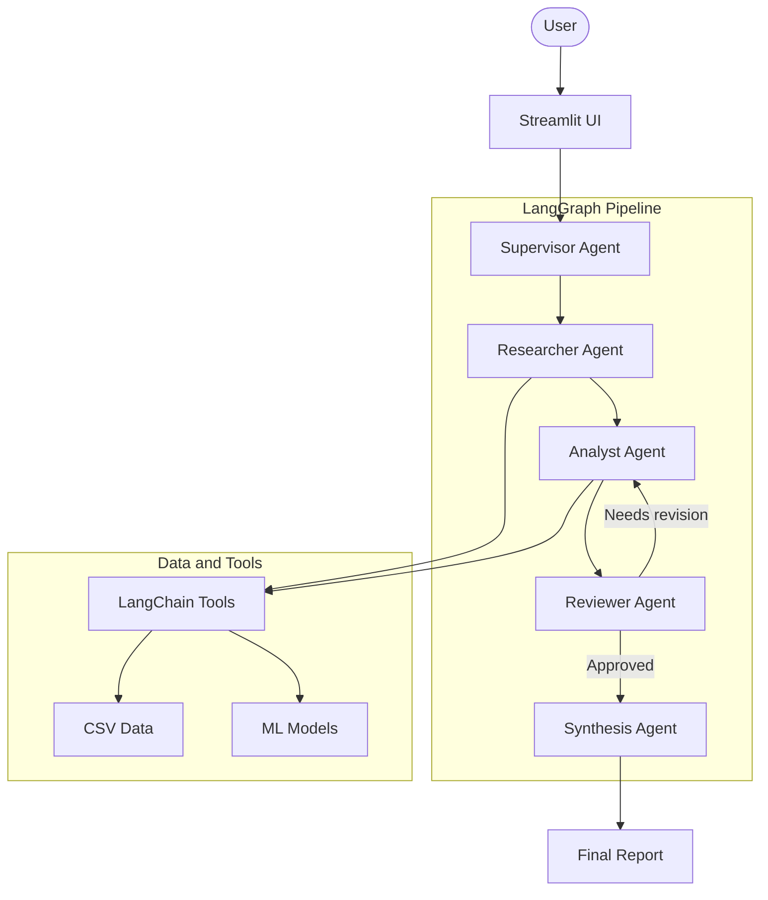

# BIZ-INSIGHT

Biz-Insight는 기업별 재무, 신용, 투자 지표와 직원 리뷰 데이터를 결합해 비전문가도 빠르게 기업 분석 리포트를 확인할 수 있도록 만든 서비스입니다.

현재 버전은 Streamlit UI와 LangGraph 기반 멀티 에이전트 파이프라인을 사용해 기업 데이터를 수집, 분석, 검토, 종합한 AI 리포트를 생성합니다.

## 주요 기능

- 기업명 검색 기반 기업 기본 정보 조회
- 기업 재무, 신용, 투자 지표, 주가, 직원 리뷰 데이터 기반 분석
- 자연어 분석 요청 기반 도메인/도구 라우팅
- LangGraph 멀티 에이전트 플로우를 통한 AI 리포트 생성
- 도구 호출 기반 CSV/ML 데이터 조회
- Reviewer Agent의 품질 검토와 보완 루프
- SWOT 분석과 종합 의견을 포함한 마크다운 리포트 제공

## 서비스 구조

서비스 진입점은 루트의 `app.py`입니다. Streamlit UI에서 기업을 검색하고 자연어 분석 요청을 입력하면 `src.graph.generate_ai_report`가 호출되어 LangGraph 플로우가 실행됩니다.



## 에이전트 역할

| Agent | 역할 |
|---|---|
| Supervisor Agent | 자연어 요청을 해석해 분석 도메인, 도구, 실행 흐름을 구성 |
| Researcher Agent | 기업 정보, 재무, 신용, 투자, 주가, 직원 리뷰 데이터를 도구로 수집 |
| Analyst Agent | 수집된 데이터를 바탕으로 정량/정성 분석 수행 |
| Reviewer Agent | 분석 결과의 논리성, 누락, 리스크 언급 여부 검토 |
| Synthesis Agent | 개별 산출물을 최종 기업 분석 리포트로 통합 |

## 데이터 소스

- 재무데이터: DART
- 신용등급데이터: NICE, 한국신용평가, 한국기업평가
- 직원평가데이터: 블라인드, 잡플래닛
- 투자/주가데이터: 네이버 금융
- 경제지표: 한국은행 경제통계시스템, 환율, 금리, CRB 등 외부 지표

## 로컬 RAG 벡터스토어

`data/`의 CSV 데이터를 검색 가능한 로컬 벡터스토어로 변환하는 모듈이 `src/rag/`에 포함되어 있습니다. 기본 backend는 외부 모델 다운로드가 필요 없는 `scikit-learn` TF-IDF입니다.

```bash
UV_PROJECT_ENVIRONMENT=bizinsight uv run --no-sync python -m src.rag.build_vectorstore build \
  --data-dir data \
  --out-dir data/vectorstore \
  --max-rows-per-doc 80 \
  --max-features 100000
```

검색 예시는 다음과 같습니다.

```bash
UV_PROJECT_ENVIRONMENT=bizinsight uv run --no-sync python -m src.rag.build_vectorstore query \
  "신용등급 재무 안정성 부채 상환능력" \
  --entity 삼성전자 \
  --top-k 3
```

## 프로젝트 구조

```text
data/
  수집 및 전처리된 CSV 데이터

src/
  agents/
    LangGraph 에이전트 노드
  tools/
    CSV 조회 및 ML 모델 도구
  rag/
    로컬 벡터스토어 생성 및 검색 모듈
  crawling/
    DART, 네이버 금융, 신용평가, 리뷰, 경제지표 수집 코드
  feature/
    신용등급 모델링, 데이터 변환, 시각화 관련 코드
  eda/
    데이터 탐색 노트북
  graph.py
    Streamlit 앱이 사용하는 LangGraph 메인 그래프
  config.py
    LLM, rate limit, 데이터 경로, CSV 매핑 설정
  state.py
    LangGraph 공유 상태 정의

app.py
  Streamlit UI 진입점
```

## 환경

```text
Python 3.13
uv
Streamlit
Pandas
LangGraph
LangChain
langchain-google-genai
python-dotenv
scikit-learn
tensorflow / keras
```

## 실행

`.env`에 `GOOGLE_API_KEY`를 설정한 뒤 실행합니다.

```bash
UV_PROJECT_ENVIRONMENT=bizinsight uv run --no-sync streamlit run app.py
```

기존 가상환경을 직접 사용할 수도 있습니다.

```bash
bizinsight/bin/python -m streamlit run app.py
```
